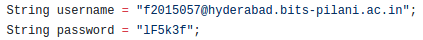

#Default Settings

####Username and Password for MERRA-2

1. Inside the *Prerequisite-Tools* folder, there is a file named *.wgetrc* file.

Inside this file, change the `http_user` to the username as needed and `http_password` to the password as needed.

You need to modify another file. Inside the *Mytrah-Web-App* folder is a file called *UsingDATFile.jsp*. Change the line numbers 17 and 18. The *user* String variable should contain the username and the *password* String variable should contain the password.

![username and password UsingDATFile] (UserPassDAT.png)

####Username and Password for ERA

The username and password entry for *ERA* is more tricky. So follow the steps carefully.

Goto the ECMWF Website by clicking [here](https://software.ecmwf.int/wiki/display/WEBAPI/Accessing+ECMWF+data+servers+in+batch) and scroll down to read the steps titled **Install ECMWF KEY**. You should see something like this :

Note that the `$HOME` environment variable must be initialised. This is already done by default and its value can be checked. Then create the `.ecmwfapirc` file in that location.

Apart from this, another change needs to be made in the *UsingERA.jsp* file present in the *Mytrah-Web-App* folder. Change the line numbers **33** and **34** by replacing the username and password values with your account values.

This is all.
