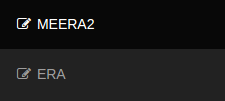
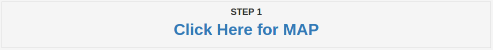
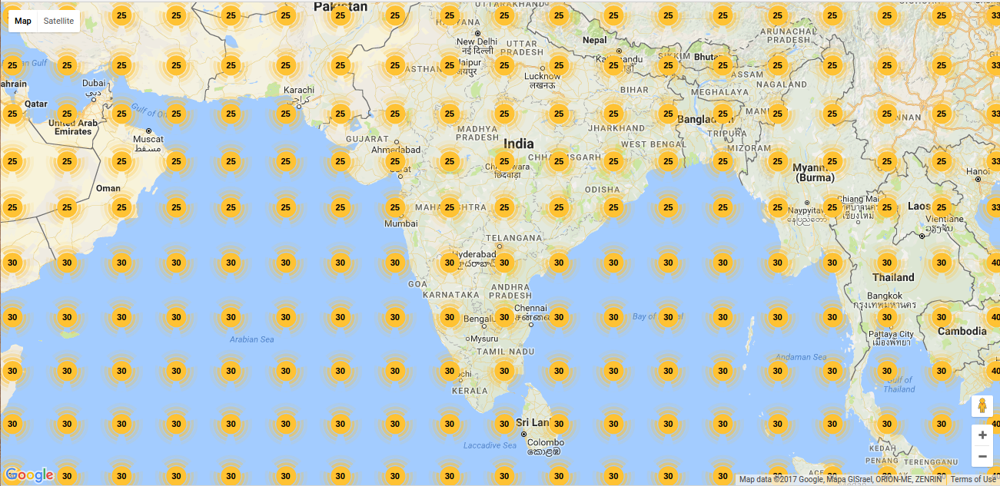
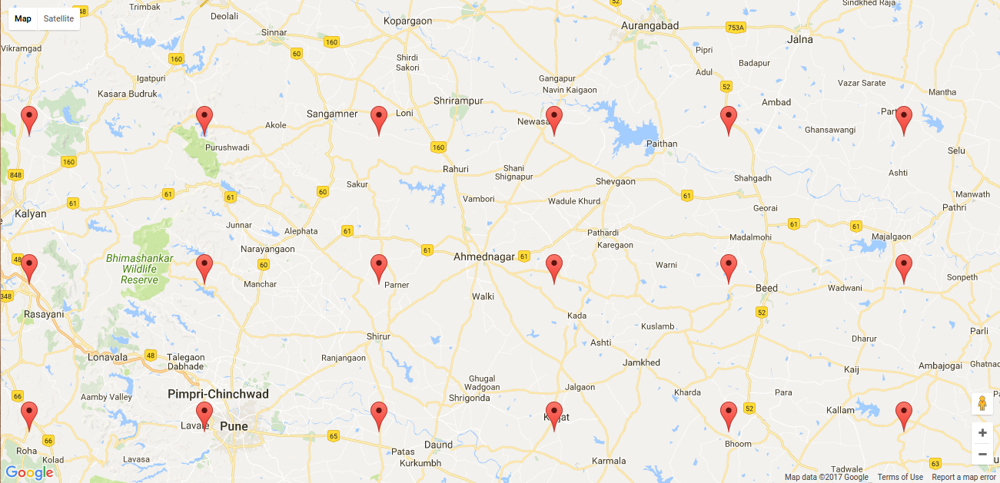

#How to use the portal

Using the portal is very easy.

###Steps

`1.` From the tab at the top-left corner of the screen, choose either *MERRA2* or *ERA*.

`2.` Then in order to view the *MAP* and decide the latitude and longitude, click on the *Click Here for MAP* link.

`3.` Zoom into the map to the location you seek. The "Nodes" will resolve themselves to **RED** colored pointers. Click on the pointers to see and obtain the respective *LAT* and *LON*.

Before Zoom-in

After Zoom-in

`4.` After obtaining this value, enter the same in the *LATITUDE* and *LONGITUDE* boxes respectively.

`5.` Select the desired start and end dates (obviously STARTDATE < ENDDATE).

`6.` Select the desired parameters.

`7.` Submit and wait.

`8.` An alert button box will appear after the excel file is ready for download.

`9.` Click on *OK* to download. The file will get downloaded.
