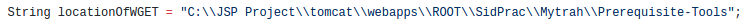

#Installation Steps

**Note : Installation steps are specific to Windows OS**

`1.` Make sure that you have installed **Apache Tomcat** server, if not then click [here](https://tomcat.apache.org/tomcat-7.0-doc/setup.html)

`2.` Change to the following working directory in **Apache Tomcat** server

```bash
$cd tomcat/webapps/ROOT
```

`3.` Now paste the *Mytrah-Web-App* folder in this location. This is the folder that contains all the back-end code needed for the working of the app.

`4.` In this same *working directory* paste another folder i.e. *WEB-INF*. You will find this folder inside the *Apache-Tomcat-WEB-INF* folder. This folder cotainer all the .jar files which in turn contain all the .class files needed by the **JSP** pages in the app.

The folder in step `2.` should now contain the *Mytrah-Web-App* and the *WEB-INF* folders.

`5.` Now `cd` to any location on your file system (your choice) and paste the *Prerequisite-Tools* folder there. This folder contains all the major **commands** as executable scripts needed by the **terminal** a.k.a. **command prompt**. These are used by the back-end code present in the *Mytrah-Web-App* folder.

`6.` The only major step now left, is to 'tell' the *Mytrah-Web-App* folder files, where the *Prerequisite-Tools* folder is present. For this, we need to make changes to 2 files.

`cd` to the *Mytrah-Web-App* folder and open the *UsingDATFile.jsp* file.

```bash
$cd tomcat/webapps/ROOT/Mytrah-Web-App
```
In line number **15**, change the value of the *locationOfWGET* String variable. This value should be equal to the location of the *Prerequisite-Tools* folder.


Note that the back-slash needs to be 'escaped' by replacing the `\` with `\\`. Spaces are left as it is.

e.g.
```bash
C:\JSP Project\tomcat\webapps\ROOT\SidPrac\Mytrah\Prerequisite-Tools  
```
Becomes
```bash
C:\\JSP Project\\tomcat\\webapps\\ROOT\\SidPrac\\Mytrah\\Prerequisite-Tools
```

In line number **16**, change the value of the *locationOfWGETPowerShell* String variable. This value should also be equal to the location of the *Prerequisite-Tools* folder. But here along with escaping the `\`, the spaces should also be taken care of using simgle quotes (`''`). Simply replace appropriate `folder name with spaces` with `'folder name with spaces'`


e.g.
```bash
C:\JSP Project\tomcat\webapps\ROOT\SidPrac\Mytrah\Prerequisite-Tools  
```
Becomes
```bash
C:\\'JSP Project'\\tomcat\\webapps\\ROOT\\SidPrac\\Mytrah\\Prerequisite-Tools
```

The reason for this is that **CMD** and **Powershell** work differently with location names.

`7.` Make similar changes to the *UsingERA.jsp* file which is also present in the same folder.

In line number **35**, change the value of the *locationOfWGET* String variable. This value should also be equal to the location of the *Prerequisite-Tools* folder.



Note that the back-slash needs to be 'escaped' by replacing the `\` with `\\`. Spaces are left as it is.

e.g.
```bash
C:\JSP Project\tomcat\webapps\ROOT\SidPrac\Mytrah\Prerequisite-Tools  
```
Becomes
```bash
C:\\JSP Project\\tomcat\\webapps\\ROOT\\SidPrac\\Mytrah\\Prerequisite-Tools
```

`8.` Please ensure that the `PATH` and `CLASS-PATH` environment variables are set properly to point to the installed java jdk. Usually, these are already set by default and nothing additional needs to be done.

`9.` Please read the **DEFAULTS** section in this documentation before proceeding.

`10.` You are now good to go! The app can be used at :

`localhost:<port for Apache>/Mytrah-Web-App/index.html`
